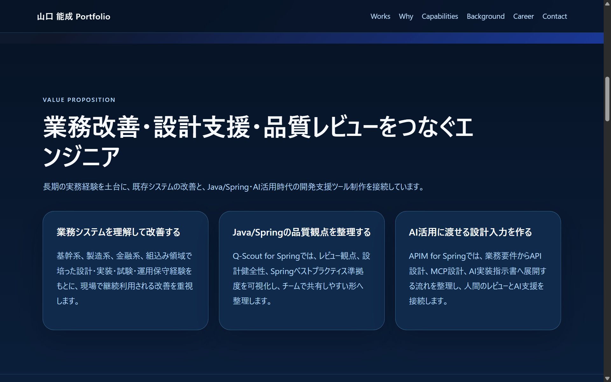
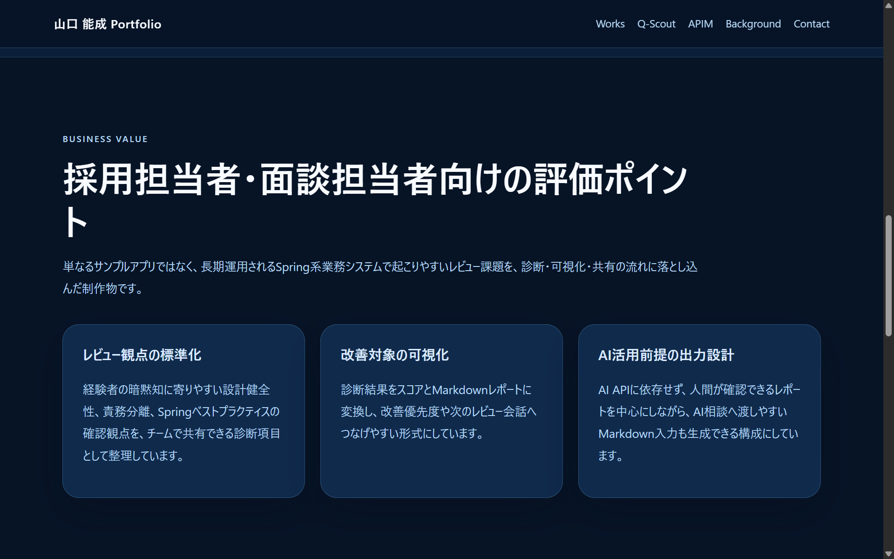
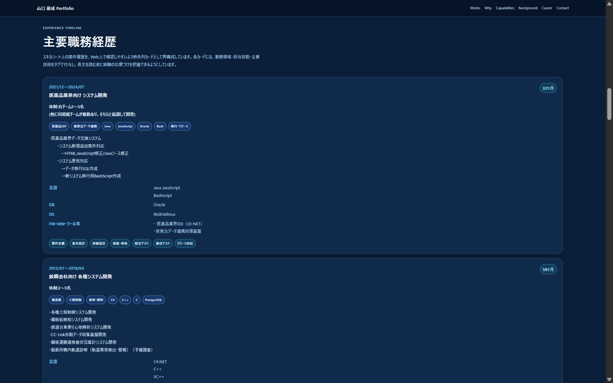

# portfolio

山口能成の公開ポートフォリオ用リポジトリです。

公開URL: https://yamaguchiyoshishigeai-create.github.io/portfolio/

このリポジトリでは、長期のシステム開発経験を基盤に、AI/Web領域への再接続を示す職務経歴型ポートフォリオを管理します。

## 初期方針

- 静的サイトとして構成する
- GitHub Pagesでの公開を想定する
- 履歴書・スキルシート原本や個人情報は配置しない
- 実企業名・顧客名・内部システム名は公開向けに抽象化する
- 改善タスクは `TSK-###` で管理する

## サイト構成

- `index.html`: 公開ポートフォリオ本体
- `assets/css/style.css`: サイトスタイル
- `assets/js/main.js`: 最小限の画面補助スクリプト
- `data/skills.json`: 技術領域データ
- `data/projects.json`: 代表プロジェクトデータ
- `docs/`: 企画、要件、設計、改善タスク管理、軽量エラー履歴

## テンプレート流用方針

`Spring-Tool-Development-Template` から、以下の運用基盤をポートフォリオ向けに軽量化して流用しています。

- docs階層の責務分離
- PROJECT_START_PROMPT_TEMPLATE
- TSK採番による改善タスク管理
- 作業主体分類
- 公開安全性確認

一方で、Spring Boot、Maven Wrapper、Java実装、CI整合チェックなど、ポートフォリオ静的サイトに不要な要素は流用対象外としています。

## 公開安全性

このリポジトリには、住所、電話番号、生年月日、年齢、履歴書原本、スキルシート原本、実企業名、顧客名、内部システム名、守秘義務に触れる詳細仕様を配置しません。


## 共通運用ルール正本

共通運用ルールの正本は `yamaguchiyoshishigeai-create/chatgpt-ops-rules` です。

本リポジトリでは、公開ポートフォリオ固有の掲載方針、公開安全性方針、静的サイト仕様、GitHub Pages公開前提、Works掲載方針、改善タスク管理を扱います。

共通運用ルールの参照方針は `docs/00_プロジェクト管理/05_横断運用規程/chatgpt-ops-rules中枢参照方針.md` を参照してください。

## 軽量エラー履歴

軽量エラー履歴の受け口は `docs/00_プロジェクト管理/06_運用改善ログ/` に配置します。

共通運用ルールおよび軽量エラー履歴の詳細ルールは `yamaguchiyoshishigeai-create/chatgpt-ops-rules` を正本とし、本リポジトリ側には公開ポートフォリオ作業で使う空の受け口と導線のみを保持します。APIMやQ-Scoutなど他リポジトリ固有の実ログは持ち込みません。


## ローカルプレビュー

静的サイトとして、任意の簡易HTTPサーバーで確認できます。

```bash
python3 -m http.server 8000
```

ブラウザで `http://localhost:8000/` を開き、トップページ、`career.html`、`works/q-scout.html`、`works/apim.html` を確認します。

Windows環境で `python3` が使えない場合は、以下を使用します。

```powershell
py -m http.server 8000
```

## 表示確認スクリーンショット

表示確認スクリーンショットは、ポートフォリオ本体へ大きく掲載する装飾画像ではなく、応募・面談・保守確認で主要画面を説明しやすくするための確認資料として扱います。

保存先は `docs/80_リリース/10_表示確認スクリーンショット/` とし、画像ファイルを追加した後にREADMEから相対パスで参照します。現時点では配置方針と命名規則のみを定義し、実画像はブラウザ表示確認後に追加します。

推奨取得対象:

| ファイル名 | 対象画面 | 確認観点 |
|---|---|---|
| `top-hero.png` | トップページ hero | 職務軸、Java/Spring、AI活用支援の訴求が伝わること |
| `top-value-proposition.png` | トップページ Value Proposition | 業務改善、品質レビュー、AI設計入力の3軸が見えること |
| `works-q-scout-business-value.png` | Q-Scout 詳細 | Business Value と評価ポイントが読めること |
| `works-apim-business-value.png` | APIM 詳細 | API/MCP設計、AI実装指示への接続が読めること |
| `career-representative-summary.png` | Career 詳細 代表案件サマリー | 代表案件4領域が一覧できること |
| `career-timeline-tags.png` | Career 詳細 主要職務経歴 | 業務領域・担当役割・主要技術タグが見えること |

READMEに画像を掲載する場合は、画像追加後に以下の形式で追記します。

```markdown
### Top / Value Proposition



### Works / Q-Scout Business Value



### Career / Timeline Tags


```

詳細な命名規則と運用方針は `docs/80_リリース/10_表示確認スクリーンショット/README.md` を参照してください。


## 公開前確認

公開前には最低限、以下を確認します。

```bash
grep -R "<<<<<<<\|=======\|>>>>>>>" .
python3 -m json.tool data/projects.json > /dev/null
git diff --check
```

確認観点:

- Git競合マーカーが残っていないこと
- `data/projects.json` がJSONとして妥当であること
- トップページのWorks、Career、Contact導線が表示できること
- 外部リンク、内部詳細ページリンクが意図したURLへ遷移すること
- 住所・電話番号などの個人情報を公開ページへ追加していないこと
